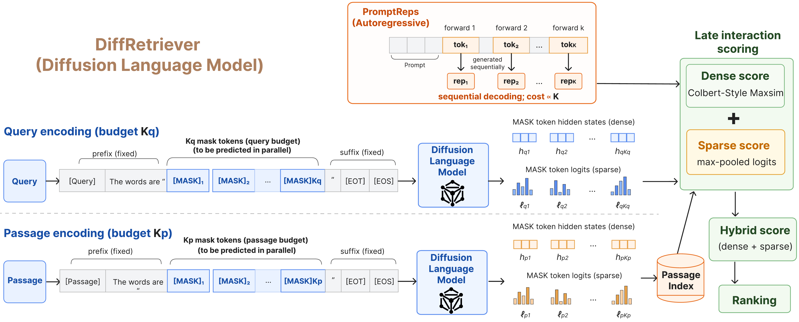

# DiffRetriever

Code for **DiffRetriever: Parallel Representative Tokens for Retrieval with Diffusion Language Models**.

DiffRetriever is a representative-token retriever for diffusion language models (e.g., Dream, LLaDA). It appends `K` masked positions to a `PromptReps`-style prompt and reads all `K` hidden states and next-token logits in a single bidirectional forward pass — giving multi-vector retrieval at the encoding cost of a single token, where the autoregressive equivalent costs `K` sequential forward passes.



<br />

<p align="center">
  
</p>

<p align="center"><sub><em>BEIR-7 NDCG@10 vs. encoding + search latency (ms/query, 100K-document MS&nbsp;MARCO sample). Left: zero-shot (PromptReps at K&le;20). Right: fine-tuned (K=4). Dashed lines link single-token (open) and multi-token (filled) variants. <strong>DiffRetriever</strong> gains from multi-token at near single-token cost in both panels; <strong>PromptReps</strong> pays &asymp;15&times; the latency at zero-shot and &asymp;3&times; at fine-tuning, with no consistent gain. Fine-tuned DiffRetriever (Dream, (K<sub>q</sub>,&nbsp;K<sub>p</sub>)=(4,&nbsp;16)) is the strongest BEIR-7 retriever in our comparison.</em></sub></p>

<br />

<p align="center">
  
</p>

<p align="center"><sub><em>Latency scaling on synthetic inputs and indices (single H100, same attention implementation across backbones). <strong>Top row:</strong> encoding latency vs.&nbsp;input sequence length. <strong>Bottom row:</strong> search latency vs.&nbsp;index size (log scale). <strong>Left column:</strong> PromptReps on autoregressive backbones (Qwen2.5, LLaMA3). <strong>Right column:</strong> DiffRetriever on diffusion backbones (Dream, LLaDA). Open markers = single-token, filled = multi-token (AR uses K=4, the fine-tuned cap; diffusion uses the train-selected (K<sub>q</sub>*, K<sub>p</sub>*)). DiffRetriever&#39;s multi-token encoding stays close to its single-token cost, while AR multi-token remains 2&ndash;3&times; AR single-token across the entire input range.</em></sub></p>

> **Models on Hugging Face:** trained checkpoints for DiffRetriever (Dream, LLaDA) and the re-trained baselines (PromptReps, DiffEmbed, RepLLaMA) will be released on the Hugging Face Hub **soon**. They are not available yet — this README will be updated with the model URLs when the release lands.

---

## What's in this repo

```
src/
├── models/                       Retrievers (zero-shot + trainable)
│   ├── trainable_diff_retriever.py    DiffRetriever (Dream / LLaDA)
│   ├── trainable_ar_retriever.py      PromptReps (autoregressive)
│   ├── diffembed_retriever.py         DiffEmbed baseline
│   ├── repllama_retriever.py          RepLLaMA baseline
│   ├── baseline_retriever.py          Zero-shot PromptReps
│   ├── dream_retriever.py             Dream backbone wrapper
│   ├── llada_retriever.py             LLaDA backbone wrapper
│   ├── block_schedule.py              Multi-step denoising schedule
│   ├── backbone_adapters.py           HF model loading / LoRA wiring
│   └── sparse_utils.py                Sparse score helpers
└── evaluation/
    └── evaluator.py              Per-query scoring + metric aggregation

scripts/
├── train_retriever.py            Train DiffRetriever
├── train_ar_retriever.py         Train PromptReps
├── train_diffembed.py            Train DiffEmbed
├── train_repllama.py             Train RepLLaMA
├── encode_promptreps.py          Encode queries / passages
├── evaluate_sweep.py             Evaluate over a (K_q, K_p) sweep
├── eval_trec.py                  Compute MRR / NDCG with pytrec-eval
├── prepare_msmarco.py            MS MARCO data prep
├── preprocess_msmarco_aug.py     Augmented triples prep
├── shard_io.py                   Sharded encoding I/O
├── download_data.sh              Fetch MS MARCO + TREC DL + BEIR-7 + NLTK data
├── run_train.sh                  Portable launcher: training
├── run_encode.sh                 Portable launcher: encoding
└── run_eval.sh                   Portable launcher: evaluation

configs/
├── ds_zero2.json                 DeepSpeed ZeRO-2 config
├── ds_zero3.json                 DeepSpeed ZeRO-3 config
├── naming.sh                     Backbone / config naming helpers
└── dataset_config.sh             Dataset path helpers

prompts/
└── default                       Representative-token prompts
```

Note: this repo bundles only what is needed to reproduce the paper. Internal analysis/plot scripts and benchmark drivers are kept in the research repository and are not redistributed here.

---

## Setup

We use conda. The pinned `requirements.txt` is a freeze of the env used during development on a single H100 node (CUDA 12.6, Linux x86_64, Python 3.10).

```bash
# 1. Create env
conda create -n diffretriever python=3.10 -y
conda activate diffretriever

# 2. Install pinned dependencies (covers training + encoding + eval)
pip install -r requirements.txt

# 3. Download the datasets and the small NLTK corpora (stopwords + punkt)
bash scripts/download_data.sh             # MS MARCO + TREC DL19/DL20 + BEIR-7 + nltk
# or selectively:
# bash scripts/download_data.sh --msmarco
# bash scripts/download_data.sh --beir
```

`requirements.txt` is exhaustive — it covers training (DeepSpeed, accelerate, peft) as well as encoding and evaluation. Training uses HuggingFace `Trainer` directly with the retriever classes under `src/models/`; there is no separate "training extras" file.

**Optional but strongly recommended for speed: flash-attention 2.** It is not pinned in `requirements.txt` because the prebuilt wheel is platform-specific. Install the matching wheel for your CUDA / torch / cxx11abi from the [flash-attention releases](https://github.com/Dao-AILab/flash-attention/releases), or:

```bash
pip install flash-attn --no-build-isolation
```

Core versions in the freeze:
- `torch==2.6.0+cu126`, `transformers==4.54.0` (Dream / LLaDA require this exact range)
- `accelerate==1.12.0`, `peft==0.18.1`, `deepspeed==0.18.8`
- `pytrec-eval-terrier==0.5.6` for retrieval metrics

---

## Backbones

The four backbones used in the paper:

| Backbone | HF id | Family |
|---|---|---|
| LLaMA3-8B-Instruct | `meta-llama/Meta-Llama-3-8B-Instruct` | Autoregressive |
| Qwen2.5-7B-Instruct | `Qwen/Qwen2.5-7B-Instruct` | Autoregressive |
| Dream-v0-Instruct-7B | `Dream-org/Dream-v0-Instruct-7B` | Diffusion |
| LLaDA-8B-Instruct | `GSAI-ML/LLaDA-8B-Instruct` | Diffusion |

`src/models/backbone_adapters.py` handles the HF loading + tokenizer setup for all four.

---

## Reproducing the paper

### Data

```bash
bash scripts/download_data.sh             # MS MARCO + TREC DL 2019/2020 + BEIR-7 + NLTK
python scripts/prepare_msmarco.py          # Optional: HF-cached MSMARCO splits
python scripts/preprocess_msmarco_aug.py   # Pre-tokenize Tevatron/msmarco-passage-aug
```

All workflow scripts are minimal portable launchers — open them, edit the variables at the top for your setup, and run. They wrap `scripts/*.py` with the canonical arguments used in the paper.

### Zero-shot retrieval

```bash
# Encode queries and passages (zero-shot DiffRetriever / PromptReps)
MODEL_TYPE=dream K=4 PROMPT_VARIANT=few \
    bash scripts/run_encode.sh

# Score the encoded representations
RESULTS_DIR=results/dream_few_K4/msmarco \
QRELS=data/msmarco/qrels.dev.tsv \
    bash scripts/run_eval.sh
```

For the (K_q, K_p) sweep over `{1, 2, 4, 8, 16}^2`, loop `run_encode.sh` over the grid (this is what the paper uses to pick `(K_q*, K_p*)` on MS MARCO train). The paper reports `(4, 16)` for Dream and `(4, 4)` for LLaDA.

### Fine-tuning

```bash
# DiffRetriever — Dream / LLaDA backbones
MODEL_TYPE=dream MODEL_NAME=Dream-org/Dream-v0-Instruct-7B \
K_Q=4 K_P=16 \
    bash scripts/run_train.sh

# PromptReps and the re-trained baselines call the matching Python scripts:
#   python scripts/train_ar_retriever.py ...   # PromptReps (AR)
#   python scripts/train_diffembed.py ...      # DiffEmbed
#   python scripts/train_repllama.py ...       # RepLLaMA
```

All training uses LoRA (r=16, α=64) + DeepSpeed ZeRO-2, InfoNCE with τ=0.01, 1 positive + 15 hard negatives, global batch 128, on the Tevatron MS MARCO augmented triples. Diffusion backbones train at the train-selected `(K_q*, K_p*)`; AR backbones train at `K=4`.

### Evaluation

```bash
# Sweep all score modes over a results directory
python scripts/evaluate_sweep.py --results_dir <dir> --qrels <qrels>

# Or score a single run with pytrec-eval
python scripts/eval_trec.py --run <runfile> --qrels <qrels>
```

---

## Citation

If you find this work useful, please cite:

```bibtex
@article{wang2026diffretriever,
  title   = {DiffRetriever: Parallel Representative Tokens for Retrieval with Diffusion Language Models},
  author  = {Wang, Shuai and Yin, Yu and Zhuang, Shengyao and Koopman, Bevan and Zuccon, Guido},
  year    = {2026},
}
```

---

## License

MIT — see [`LICENSE`](LICENSE).