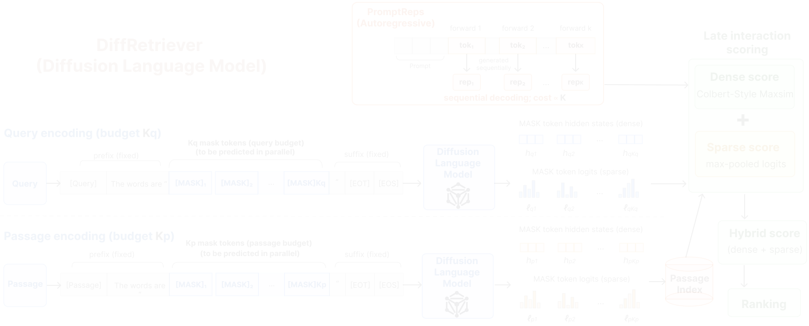
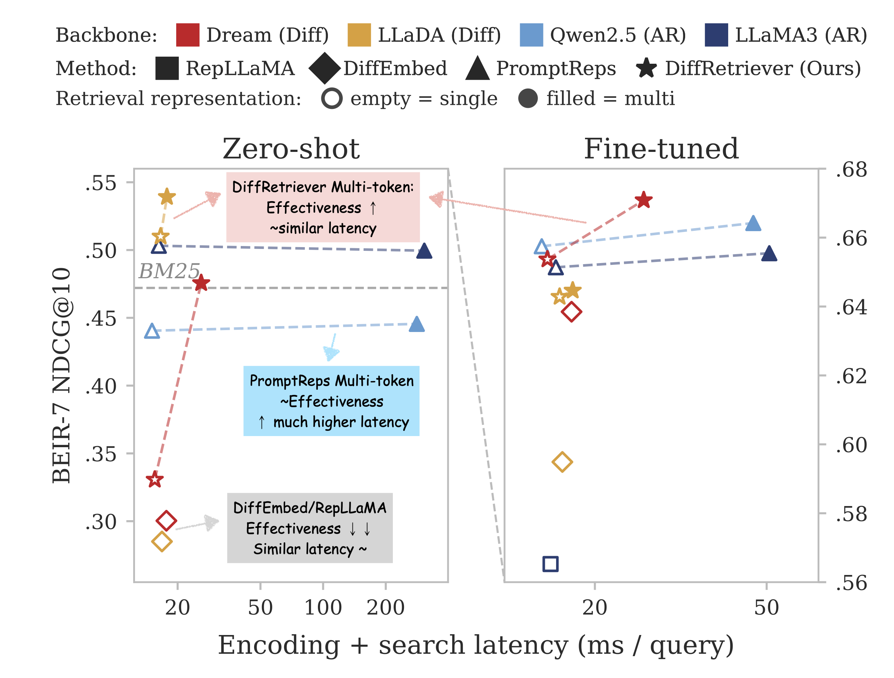
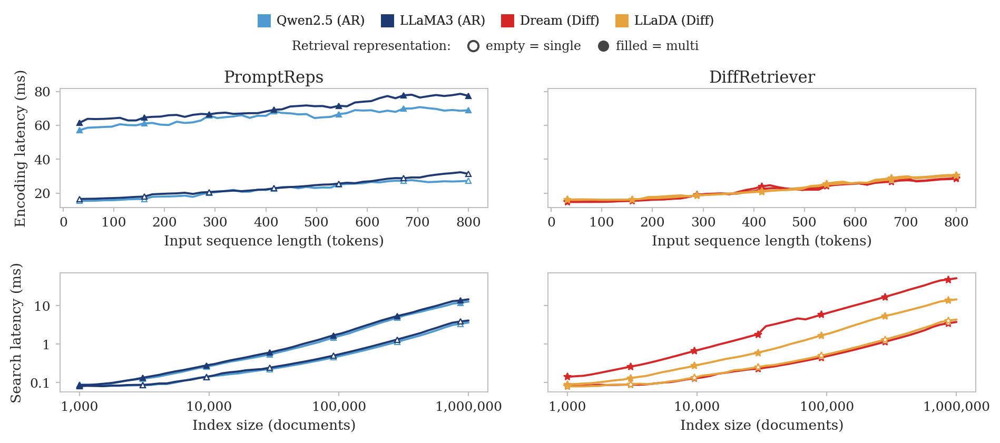

<h1 align="center">DiffRetriever</h1>

<p align="center"><b>Parallel Representative Tokens for Retrieval with Diffusion Language Models</b></p>

<p align="center">
  <a href="LICENSE"></a>
  <a href="https://www.python.org/downloads/release/python-3100/"></a>
  <a href="https://pytorch.org/"></a>
  <a href="https://huggingface.co/Dream-org/Dream-v0-Instruct-7B"></a>
  <a href="https://github.com/ielab/diffretriever/stargazers"></a>
</p>

<p align="center">
  <a href="#-quick-start-30-seconds">Quick Start</a> ·
  <a href="#-setup">Setup</a> ·
  <a href="#-backbones">Backbones</a> ·
  <a href="#-reproducing-the-paper">Reproducing</a> ·
  <a href="#-repository-layout">Layout</a> ·
  <a href="#-citation">Citation</a>
</p>

---

> **TL;DR** — Diffusion language models (DLMs) generate responses through a *masked-position prediction* interface: they pre-allocate masked output positions and predict them jointly under bidirectional attention. **DiffRetriever** uses that interface directly for retrieval. It appends $K$ masked positions after a retrieval prompt and reads $K$ hidden states and $K$ logit vectors from a *single* forward pass. With $K{=}1$ this already beats encoder-style diffusion retrieval; with $K{>}1$ it gives ColBERT-style multi-representation retrieval at near single-pass encoding cost. The autoregressive equivalent must decode $K$ tokens sequentially, paying $\approx 15\times$ the encoding latency at zero shot.



<p align="center"><sub><em>Overview of <strong>DiffRetriever</strong>. A query and a passage are each formatted with a retrieval prompt that ends in $K_q$ (query) or $K_p$ (passage) <code>[MASK]</code> positions, capped by fixed suffix tokens. A diffusion language model reads all masked positions in a single bidirectional forward pass, yielding $K$ hidden states for dense retrieval and $K$ next-token logit vectors for sparse retrieval on each side. Scoring uses ColBERT-style MaxSim on the dense vectors and max-pooled logits on the sparse vectors, followed by hybrid score interpolation. PromptReps on an autoregressive backbone generates retrieval representations sequentially up to a maximum budget $N$, so wall-clock cost grows with the number generated; DiffRetriever pre-allocates $K$ masked positions and reads them in parallel from one pass.</em></sub></p>

<br />

<p align="center">
  
</p>

<p align="center"><sub><em>BEIR-7 NDCG@10 vs. query encoding plus search latency (ms/query, 100K-document MS&nbsp;MARCO sample). Left: zero-shot. Right: fine-tuned. Dashed lines link single-representation and multi-representation variants of the same system. <strong>DiffRetriever</strong> gains from multi-representation retrieval at near single-representation cost in both panels; the autoregressive <strong>PromptReps</strong> equivalent pays much higher latency for the same number of representations. Across MS&nbsp;MARCO dev, TREC DL 19/20, and BEIR-7, DiffRetriever obtains the strongest aggregate effectiveness within our matched comparison.</em></sub></p>

<br />

<p align="center">
  
</p>

<p align="center"><sub><em>Latency scaling on synthetic inputs and indices (single H100, same attention backend across backbones). <strong>Top row:</strong> encoding latency vs. input sequence length. <strong>Bottom row:</strong> search latency vs. index size (log scale). <strong>Left column:</strong> autoregressive PromptReps (Qwen2.5, LLaMA3). <strong>Right column:</strong> DiffRetriever on diffusion backbones (Dream, LLaDA). Open markers = single-representation, filled = multi-representation. DiffRetriever's multi-representation encoding stays close to its single-representation cost, while AR multi-representation remains 2&ndash;3&times; AR single-representation across the input range.</em></sub></p>

> **Models on Hugging Face:** trained checkpoints for DiffRetriever (Dream, LLaDA) are available on the [Hugging Face Hub](https://huggingface.co/collections/ielabgroup/diffretriever).

---

## 🚀 Quick Start (30 seconds)

**Zero-shot retrieval with Dream-7B, end-to-end in pure Python — no SLURM, no scripts, no data download.**

After [setting up the env](#-setup) (`pip install -r requirements.txt`), paste this whole block into a file (`demo.py`) at the repo root and run it. The model auto-downloads from HuggingFace on first run (~14 GB).

```python
"""DiffRetriever zero-shot demo — Dream-7B, K=4 masked positions, single forward pass."""
import sys
sys.path.insert(0, "src")  # repo-local import

import torch
import torch.nn.functional as F
from models.diffretriever_dream import DreamRetriever

# 1. Load the encoder (zero-shot — no fine-tuning required)
model = DreamRetriever(
    model_name="Dream-org/Dream-v0-Instruct-7B",
    max_length=512,
    n_gen_tokens=4,                       # K = number of masked positions appended
    num_denoise_steps=1,                  # S=1 — a single forward pass
    query_prompt="prompts/default/query_prompt_few.yaml",
    passage_prompt="prompts/default/passage_prompt_few.yaml",
)
model.eval()

# 2. Tiny demo corpus
queries = [
    "what causes the seasons on earth?",
    "best way to learn guitar at home",
]
passages = [
    "The tilt of Earth's axis relative to its orbital plane causes seasonal variation in sunlight.",
    "Pick a beginner-friendly acoustic guitar and practice 15 minutes daily with online tutorials.",
    "Photosynthesis converts carbon dioxide and water into glucose using sunlight.",
    "Plate tectonics describes how Earth's lithosphere is divided into moving plates.",
    "Online video lessons are an efficient way to learn an instrument at your own pace.",
]

# 3. Encode — one forward pass returns repr_hidden ([N, K, H]) and sparse activations
with torch.inference_mode():
    q = model.encode(queries,  is_query=True,  encoding_mode="promptreps", encode_type="all_steps")
    p = model.encode(passages, is_query=False, encoding_mode="promptreps", encode_type="all_steps")

# 4. ColBERT MaxSim scoring on the K-vector outputs
q_vec = F.normalize(q["repr_hidden"].float(), dim=-1)         # [Q, K_q, H]
p_vec = F.normalize(p["repr_hidden"].float(), dim=-1)         # [P, K_p, H]
sim   = torch.einsum("qkh,pdh->qkpd", q_vec, p_vec)           # [Q, K_q, P, K_p]
scores = sim.max(dim=-1).values.clamp(min=0).sum(dim=1)       # [Q, P]

# 5. Top-3 hits per query
for i, query in enumerate(queries):
    top = scores[i].topk(3)
    print(f"\nQ: {query}")
    for s, idx in zip(top.values.tolist(), top.indices.tolist()):
        print(f"  {s:.3f}  {passages[idx]}")
```

Expected output (scores will vary slightly across GPUs):
```
Q: what causes the seasons on earth?
  3.21  The tilt of Earth's axis relative to its orbital plane causes seasonal variation in sunlight.
  2.18  Plate tectonics describes how Earth's lithosphere is divided into moving plates.
  1.92  Photosynthesis converts carbon dioxide and water into glucose using sunlight.

Q: best way to learn guitar at home
  3.05  Pick a beginner-friendly acoustic guitar and practice 15 minutes daily with online tutorials.
  2.41  Online video lessons are an efficient way to learn an instrument at your own pace.
  1.55  Photosynthesis converts carbon dioxide and water into glucose using sunlight.
```

That's the whole pipeline — append $K$ masked positions, run one bidirectional forward pass, do MaxSim. To swap in **LLaDA**, replace `DreamRetriever` with `LLaDA2Retriever` (`from models.diffretriever_llada import LLaDA2Retriever`). To run **sparse** retrieval, use the `sparse_indices` / `sparse_values` keys also returned by `encode(...)`. To run **fusion (hybrid)**, blend dense + sparse with min-max normalisation following PromptReps. The full sweep is wrapped in `scripts/run_encode.sh` + `scripts/run_eval.sh`.

---

## 🧠 What's in this repo

```
src/
├── models/                       Retrievers (zero-shot + trainable)
│   ├── diffretriever_dream.py             Zero-shot DiffRetriever — Dream backbone
│   ├── diffretriever_llada.py             Zero-shot DiffRetriever — LLaDA backbone
│   ├── diffretriever_trainable.py    Fine-tunable DiffRetriever (Dream / LLaDA)
│   ├── promptreps.py          Zero-shot PromptReps (autoregressive)
│   ├── promptreps_trainable.py      Fine-tunable PromptReps (autoregressive)
│   ├── diffembed.py         DiffEmbed baseline (encoder-style DLM)
│   ├── repllama.py          RepLLaMA baseline (autoregressive)
│   ├── bottleneck_retriever.py        Bottleneck / Semantic-Hub variant (ablation)
│   ├── block_schedule.py              Multi-step denoising schedule
│   ├── backbone_adapters.py           HF model loading / LoRA wiring
│   └── sparse_utils.py                Sparse score helpers (content-word filter)
└── evaluation/
    └── evaluator.py              Per-query scoring + metric aggregation

scripts/
├── train_diffretriever.py            Train DiffRetriever (Dream / LLaDA)
├── train_promptreps.py         Train PromptReps (LLaMA3 / Qwen2.5)
├── train_diffembed.py            Train DiffEmbed
├── train_repllama.py             Train RepLLaMA
├── encode.py          Encode queries / passages (all retrievers go through this)
├── evaluate_sweep.py             Evaluate over the (K_q, K_p) sweep
├── eval_trec.py                  Compute MRR / NDCG with pytrec-eval
├── prepare_msmarco.py            MS MARCO data prep
├── preprocess_msmarco_aug.py     Augmented triples prep
├── shard_io.py                   Sharded encoding I/O
├── download_data.sh              Fetch MS MARCO + TREC DL + BEIR-7 + NLTK data
├── run_train.sh                  Portable launcher: training
├── run_encode.sh                 Portable launcher: encoding
└── run_eval.sh                   Portable launcher: evaluation

configs/
├── ds_zero2.json                 DeepSpeed ZeRO-2 config
├── ds_zero3.json                 DeepSpeed ZeRO-3 config
├── naming.sh                     Backbone / config naming helpers
└── dataset_config.sh             Dataset path helpers

prompts/default/                  Retrieval prompts (see §3.1 of the paper)
├── query_prompt_one.yaml         "one word"   — single-representation (K=1)
├── query_prompt_few.yaml         "a few words" — multi-representation (K>1)
└── passage_prompt_{one,few}.yaml same template with "Query" → "Passage"
```

Note: this repo bundles only what's needed to reproduce the paper. Internal analysis / plot scripts and benchmark drivers are kept in the research repository and are not redistributed here.

---

## 📦 Setup

We use conda. The pinned `requirements.txt` is a freeze of the env used during development on a single H100 node (CUDA 12.6, Linux x86_64, Python 3.10).

```bash
# 1. Create env
conda create -n diffretriever python=3.10 -y
conda activate diffretriever

# 2. Install pinned dependencies (covers training + encoding + eval)
pip install -r requirements.txt

# 3. Download the datasets and the small NLTK corpora (stopwords + punkt)
bash scripts/download_data.sh             # MS MARCO + TREC DL19/DL20 + BEIR-7 + nltk
# or selectively:
# bash scripts/download_data.sh --msmarco
# bash scripts/download_data.sh --beir
```

`requirements.txt` is exhaustive — it covers training (DeepSpeed, accelerate, peft) as well as encoding and evaluation. Training uses HuggingFace `Trainer` directly with the retriever classes under `src/models/`; there is no separate "training extras" file.

**Optional but strongly recommended for speed: flash-attention 2.** It is not pinned in `requirements.txt` because the prebuilt wheel is platform-specific. Install the matching wheel for your CUDA / torch / cxx11abi from the [flash-attention releases](https://github.com/Dao-AILab/flash-attention/releases), or:

```bash
pip install flash-attn --no-build-isolation
```

Core versions in the freeze:
- `torch==2.6.0+cu126`, `transformers==4.54.0` (Dream / LLaDA require this exact range)
- `accelerate==1.12.0`, `peft==0.18.1`, `deepspeed==0.18.8`
- `pytrec-eval-terrier==0.5.6` for retrieval metrics

---

## 🤗 Backbones

The four backbones used in the paper (~7--8B parameters each):

| Backbone | HF id | Family |
|---|---|---|
| LLaMA3-8B-Instruct | `meta-llama/Meta-Llama-3-8B-Instruct` | Autoregressive |
| Qwen2.5-7B-Instruct | `Qwen/Qwen2.5-7B-Instruct` | Autoregressive |
| Dream-v0-Instruct-7B | `Dream-org/Dream-v0-Instruct-7B` | Diffusion |
| LLaDA-8B-Instruct | `GSAI-ML/LLaDA-8B-Instruct` | Diffusion |

`src/models/backbone_adapters.py` handles the HF loading + tokenizer setup for all four. Dream is initialised from Qwen2.5 and then trained with masked-position denoising, which gives our tightest controlled comparison between autoregressive and diffusion decoding (same architecture and initialisation, different training objective).

---

## 🧪 Reproducing the paper

### Data

```bash
bash scripts/download_data.sh             # MS MARCO + TREC DL 2019/2020 + BEIR-7 + NLTK
python scripts/prepare_msmarco.py          # Optional: HF-cached MSMARCO splits
python scripts/preprocess_msmarco_aug.py   # Pre-tokenize Tevatron/msmarco-passage-aug
```

All workflow scripts are minimal portable launchers — open them, edit the variables at the top for your setup, and run. They wrap `scripts/*.py` with the canonical arguments used in the paper.

### Zero-shot retrieval

The portable launchers wrap the underlying Python scripts with the canonical paper arguments — open them and edit the variables at the top for your local paths.

```bash
# Encode queries and passages (zero-shot DiffRetriever / PromptReps)
MODEL_TYPE=dream K=4 PROMPT_VARIANT=few \
    bash scripts/run_encode.sh

# Score the encoded representations
RESULTS_DIR=results/dream_few_K4/msmarco \
QRELS=data/msmarco/qrels.dev.tsv \
    bash scripts/run_eval.sh
```

Or invoke the underlying scripts directly (this is what the launchers call):

```bash
# 1. Encode queries — one shard at a time (--input_file is required)
python scripts/encode.py \
    --model_type dream \
    --model_name_or_path Dream-org/Dream-v0-Instruct-7B \
    --input_file  data/msmarco/queries.dev.jsonl \
    --output_dir  results/dream_few_K4/msmarco/queries \
    --is_query \
    --query_prompt   prompts/default/query_prompt_few.yaml \
    --passage_prompt prompts/default/passage_prompt_few.yaml \
    --n_gen_tokens 4 --num_denoise_steps 1 \
    --encode_type all_steps --sparse_topk 256 \
    --shard_id 0 --num_shards 1

# 2. Encode corpus the same way (--input_file data/msmarco/corpus.jsonl,
#    drop --is_query, set --num_shards to fan out across the cluster)

# 3. Score — produces summary.json + {mode}.json + {mode}.trec per mode
python scripts/evaluate_sweep.py \
    --query_dir  results/dream_few_K4/msmarco/queries \
    --corpus_dir results/dream_few_K4/msmarco/corpus \
    --qrels      data/msmarco/qrels.dev.tsv \
    --output_dir results/dream_few_K4/msmarco/eval
```

For the $(K_q, K_p)$ selection sweep over $\{1, 2, 4, 8, 16\}^2$, loop the encode call over the grid (this is what the paper uses to pick $(K_q^*, K_p^*)$ on MS MARCO train). The paper reports $(K_q^*, K_p^*){=}(4, 16)$ for Dream and $(4, 4)$ for LLaDA.

### Fine-tuning

```bash
# DiffRetriever — Dream / LLaDA backbones
MODEL_TYPE=dream MODEL_NAME=Dream-org/Dream-v0-Instruct-7B \
K_Q=4 K_P=16 \
    bash scripts/run_train.sh

# PromptReps and the re-trained baselines call the matching Python scripts:
#   python scripts/train_promptreps.py ...   # PromptReps  (LLaMA3 / Qwen2.5)
#   python scripts/train_diffembed.py ...      # DiffEmbed
#   python scripts/train_repllama.py ...       # RepLLaMA
```

All fine-tuning uses LoRA (`r=16, α=64`) + DeepSpeed ZeRO-2, InfoNCE with temperature `τ=0.01`, one positive + 15 hard negatives, global batch 128, on the Tevatron MS MARCO augmented triples. Diffusion backbones train at their train-selected $(K_q^*, K_p^*)$; autoregressive backbones use a generation cap of `N=4` during fine-tuning (zero-shot uses `N=20`).

### Evaluation

```bash
# Sweep all five score modes against encoded representations in one pass:
#   single_dense, multi_dense, sparse_max,
#   fusion_single_sparse_max, fusion_multi_sparse_max
python scripts/evaluate_sweep.py \
    --query_dir  <encoded queries dir> \
    --corpus_dir <encoded corpus dir> \
    --qrels      <qrels.tsv> \
    --output_dir <output dir>

# Or score a single TREC run file with pytrec-eval (positional args: qrels first, run second)
python scripts/eval_trec.py <qrels> <runfile> --metrics mrr_cut_10 ndcg_cut_10
```

The five score modes map to the paper's scoring breakdown:
- `single_dense` — inner product on the $K{=}1$ representation, or mean-pool of $K{>}1$ representations.
- `multi_dense` — ColBERT MaxSim over the $K_q \times K_p$ representations (Equation 1 in the paper).
- `sparse_max` — max-pooled $\log(1 + \mathrm{ReLU}(\ell))$ on logits across the $K$ representations (Equation 2).
- `fusion_*_sparse_max` — equal-weight min-max-normalised hybrid of the corresponding dense + sparse scores (Equation 3).

---

## 📁 Repository layout

See [What's in this repo](#-whats-in-this-repo) above for the full tree.

---

## 📝 Citation

If you find this work useful, please cite:

```bibtex
@article{wang2026diffretriever,
  title={DiffRetriever: Parallel Representative Tokens for Retrieval with Diffusion Language Models},
  author={Wang, Shuai and Yin, Yu and Zhuang, Shengyao and Koopman, Bevan and Zuccon, Guido},
  journal={arXiv preprint arXiv:2605.07210},
  year={2026}
}
```

---

## 📄 License

MIT — see [`LICENSE`](LICENSE).
